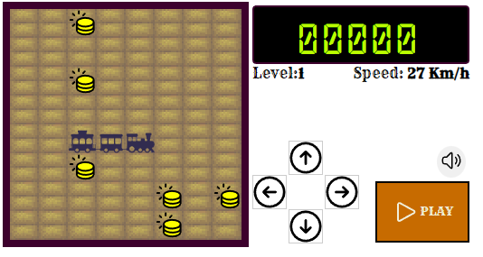

# Iron Train

Este é um jogo no estilo do clássico **Snake** mas no lugar de uma cobrinha você controla um TREM.

O jogo foi desenvolvido usando-se somente *HTML*, *CSS* e *JS* sem uso de nenhum framework ou pacote adicional.

Os **sprites** do trem e das moedas criados a partir de imagens obtidas na internet e que foram alteradas usando programas gratuitos de desenho ([GIMP](https://www.gimp.org/) e [InkScape](https://inkscape.org/) )

Outros assets (fontes, imagens, música e efeitos sonoros) são gratuitos para uso pessoal, sem fins lucrativos, e foram obtidos em sites na internet

## Projeto 1 
O jogo foi criado como o Projeto 1 do treinamento web dev da Iron Hack.

### link apresentação
Para acessar o aquivo no Google Drive onde está a apresentação deste projeto clique neste link:
[Apresentação Iron Train](https://docs.google.com/presentation/d/1gAYnlsro75HB1-OGVhw-zRLVKLOoR-R5ol2lwrjf9rA/edit?usp=sharing)

### link deploy
Este projeto está publicado na internet, no Git Pages, para acessar o deploy clique neste link:
[Deploy Iron Train](https://ewertonvaz.github.io/iron-train-enap/)

## Como jogar
Você pode movimentar o trem utilizando o mouse para clicar nas setas que aparecem na tela, ou as setas do teclado.

No teclado a barra de espaço aciona o botão PAUSE / PLAY.

O botão com o autofalante serve pra ligar / desligar a música do jogo. Os efeitos sonoros não são desativados, somente a música.

O objetivo do jogo é recolher todas as moedas e com isso passar para a próxima fase.

As moedas valem 10 pontos e sua localização é gerada aleatoriamente no início de cada fase.

Após recolher todas as moedas o jogador passa para a próxima fase, o trem cresce no tamanho de um vagão e a sua velocidade aumenta. A cada 100 pontos conseguidos também fazem com que seja aumentada a velocidade do trem.

O jogo acba quando você colidir com as bordas do tabuleiro, ou com os vagões do próprio trem.

# Instalação
Clonar o repositório com o comando:

`git clone https://github.com/ewertonvaz/iron-train-enap.git`

Em seguida abrir o arquivo **index.html** usando o Live Server no VSCode.

## Estrutura das pastas

Na pasta *assets* existem as subpastas *fonts*, *img* e *sounds*, onde estão, respectivamente, as fontes de texto, as imagesn e os audios utilizados neste projeto.

Na pasta *docs* estão as imagens e documentos utlizados neste aquivo README.md.

A pasta *js* armazena o código fonte em *Java Script* deste projeto e contém os seguinte arquivos:
* **board.js** - implementação da classes *Board* que contém o código do tabuleiro do jogo, e corresponde à área onde o trem se movimenta;
* **bodyPart.js** - arquivo fonte da classe *BodyPart* que é responsável pela implementação dos componentes do trem. Neste arquivo estão as classes especializadas *Head*, *Segment* e *Tail*, que, respectivamente, correspondem ao primeiro  (locomotiva), aos intermediários e ao último vagão do trem. 
* **index.js** - corresponde a implementação do jogo. É o arquivo principal que, entre outras coisas, cria o ambiente; desenha os itens na tela; inicia o loop do jogo e detecta as colisões.
* **snake.js** - implementa o trem utilizando as classes que estão no arquivo *bodyPart.js* para montar o trem no jogo. Responsável pela lógica de movimentação do trem. Aqui também estão os código que controlam a direção e velocidade do trem. **p.s** comecei pensando em fazer um jogo com o nome *Iron Snake*, quando decidi mudar para *Iron Train* não mudei o nome deste arquivo porque fiquei com medo de quebrar alguma coisa no código que já estava pronto.
* **util.js** - contém  código de funções de utilidades genérica que podem ser usados em qualquer lugar do jogo. Neste caso somente a função *getRandomInt* que utilizei para gerar números inteiros aleatórios.

A pasta *styles* contém os arquivos CSS onde estão as regras de estilização das telas e elementos do jogo. Nela existem os arquivos:
* **elements.css** - armazena as regras CSS para o corpo do trem e para os itens, neste caso as moedas.
* **gamewindows.css** - contém o CSS que estiliza apenas a tela inical de seleção do tamanho do tabuleiro e que foi estilizada como uma tela modal utilizando as regras que estão neste arquivo.
* **style.css** - contém o CSS que estilzia os demais itens da tela do jogo, como o tabuleiro, os botões de controle e de pausa, e as telas de passagem de nível. É o arquivo principal e somente ele é linkado no html usando a tag *link* na seção *head*. Os outros dois arquivos mencionados acima são referenciados neste **style.css** utilzando o *@import*.